---
<p align="center">
  
</p>

---
# School Manager — Offline Flutter Android App

A complete, 100% offline School Management System for Android, built with Flutter + SQLite.

---

## Features

| Module | Features |
|---|---|
| School Setup | First-run wizard, school logo, edit later |
| Classes & Sections | Add/edit/delete classes and sections, **student counts per class/section** |
| Students | Add/edit/search/filter, registration, quick delete, **list by section** |
| Excel Import | Bulk student import from `.xlsx` template |
| Attendance | Daily attendance by class/section, absent SMS |
| Fee Management | Monthly records, **edit totals/discounts**, **remove specific payments**, **class/section filtering** |
| Fee Payments | Multiple payments per record, receipt PDF, **payment history with deletion** |
| Marks & Exams | Per-exam marks entry by subject |
| Daily Tests | Create/track daily classroom tests and scores |
| Employee Management | **Edit employee details**, salary tracking, attendance, **payment history with deletion** |
| SMS Center | Direct SIM SMS, editable templates, automated alerts |
| App PIN Lock | 4-digit secure lock, recovery via school name, persistent |
| Dark Mode | Premium dark theme support with dashboard toggle |
| Centralized Files | All exports organized in "School's Files" Downloads folder |
| Backup & Restore | Full JSON export/import, survives reinstall |

---

## Tech Stack

- **Flutter** (Dart)
- **sqflite** — SQLite local database
- **flutter_riverpod** — State management
- **excel** — Excel import
- **pdf + printing** — PDF generation
- **telephony** — SMS via device SIM
- **file_picker** — File selection
- **path_provider** — Local storage paths
- **share_plus** — Share files
- **permission_handler** — Runtime permissions

---

## Project Structure

```
lib/
├── main.dart                   # Entry point, routing
├── models/
│   └── models.dart             # All data models
├── core/
│   ├── db/
│   │   └── database_helper.dart  # SQLite — all tables & queries
│   └── services/
│       ├── providers.dart        # Riverpod providers
│       ├── sms_service.dart      # SMS via Android SIM
│       ├── fee_service.dart      # Fee record generation & payments
│       ├── promotion_service.dart # Year-end promotion
│       ├── security_service.dart # App PIN lock & encryption
│       ├── pdf_service.dart      # PDF receipts & reports
│       ├── excel_import_service.dart # .xlsx bulk import
│       └── backup_service.dart   # JSON backup/restore
├── shared/
│   ├── theme/app_theme.dart    # App colors, typography
│   └── widgets/lock_screen.dart # PIN entry UI
│   └── widgets/shared_widgets.dart # Reusable UI components
└── features/
    ├── setup/                  # First launch + school setup
    ├── dashboard/              # Home dashboard with stats
    ├── classes/                # Class & section management
    ├── students/               # Student CRUD + search
    ├── promotion/              # Year-end promotion
    ├── attendance/             # Daily attendance
    ├── fees/                   # Fee management + payments
    ├── marks/                  # Exams, subjects, marks
    ├── sms/                    # SMS center + templates
    ├── backup_restore/         # Backup & restore
    └── settings/               # App settings
```

---

## Database Tables

| Table | Purpose |
|---|---|
| school_settings | School name, address, logo |
| classes | Class definitions |
| sections | Sections per class |
| students | Student records (unique reg_no) |
| student_promotions | Promotion history |
| attendance | Daily attendance (unique per student+date) |
| fee_structures | Class-wise fee config |
| fee_records | Monthly fee per student (unique per student+month+year) |
| fee_payments | Individual payments with receipt numbers |
| exams | Exam definitions |
| subjects | Subjects per class |
| marks | Student marks per exam+subject |
| sms_templates | Editable SMS templates |
| sms_logs | All sent/failed SMS log |
| app_counters | Receipt number counter etc. |

---

## Setup Instructions

### Prerequisites
- Flutter SDK ≥ 3.0.0
- Android Studio / VS Code
- Android device or emulator (API 21+)

### Steps
```bash
# 1. Clone / extract project
cd school_manager

# 2. Install dependencies
flutter pub get

# 3. Run on Android
flutter run

# 4. Build APK for distribution
flutter build apk --release
```

### Required Permissions (Android)
- `SEND_SMS` — send attendance & fee SMS
- `READ_EXTERNAL_STORAGE` / `WRITE_EXTERNAL_STORAGE` — save PDFs & backups
- `MANAGE_EXTERNAL_STORAGE` (Android 11+) — file access

---

## SMS Placeholders

| Placeholder | Description |
|---|---|
| `{student_name}` | Student full name |
| `{class_name}` | Class name |
| `{section_name}` | Section name |
| `{date}` | Attendance date |
| `{due_amount}` | Fee due amount |
| `{paid_amount}` | Amount paid |
| `{month_name}` | Month name |
| `{year}` | Year |
| `{due_date}` | Fee due date |
| `{payment_date}` | Payment date |
| `{custom_message}` | Custom notice text |

---

## PDF Output Paths

| Type | Path |
|---|---|
| Central Folder | `Downloads/School's Files/` |
| Fee Receipts | `Downloads/School's Files/Receipts/` |
| Reports | `Downloads/School's Files/Reports/` |
| Backups | `Downloads/School's Files/Backups/` |
| Templates | `Downloads/School's Files/Templates/` |

---

## Receipt Number Format
`RCPT-2026-0001`, `RCPT-2026-0002`, ...

---

## Pakistan Phone Validation
Guardian phone numbers are validated for Pakistan format: `03XXXXXXXXX` (11 digits starting with 03).

---

## Backup & Restore
- Create backup anytime from Settings → Backup & Restore
- Backup file is a JSON export of ALL database tables
- After reinstall, use **Restore From Backup** on first launch screen to recover everything

---

## First Launch Flow

```
App Install
    │
    ├─ School Settings Exist? ─NO──► First Launch Screen
    │                                      │
    │                           ┌──────────┴──────────┐
    │                           │                     │
    │                    Setup New School      Restore Backup
    │                           │                     │
    │                     Setup Wizard        Select .json File
    │                           │                     │
    └─────YES───► Dashboard ◄───┴─────────────────────┘
```


## 📸 Screenshots
<p align="center">
  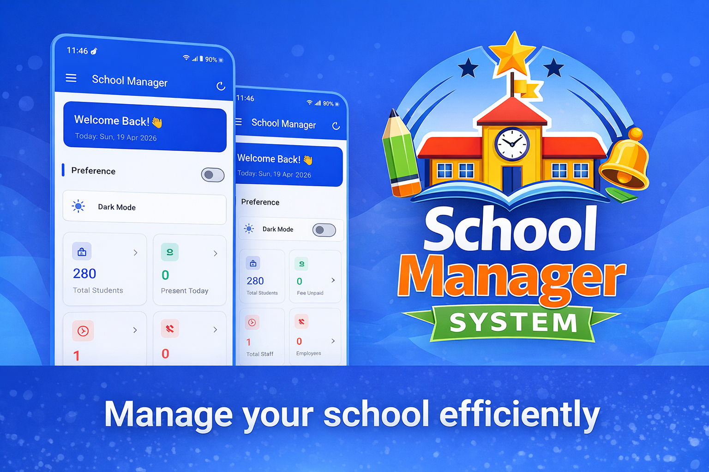
</p>
<p align="center">
  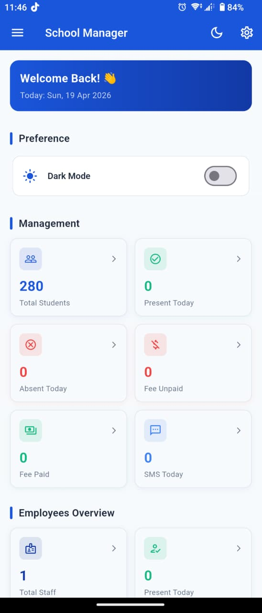
  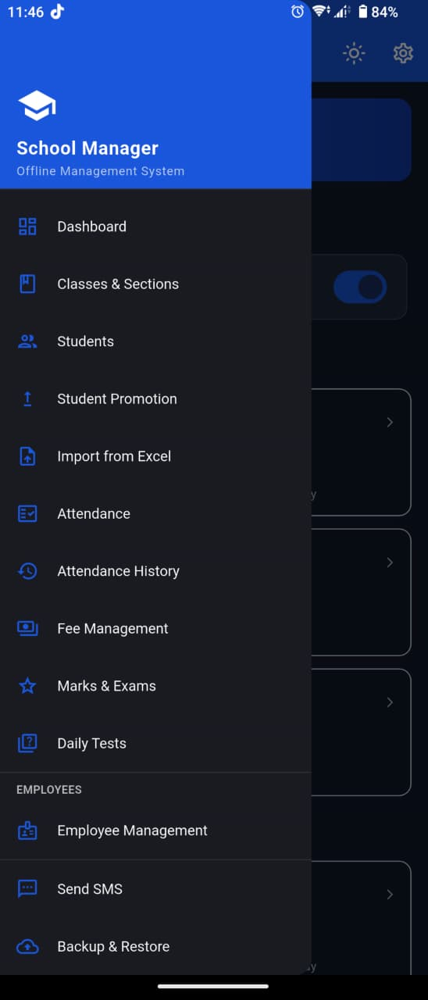
  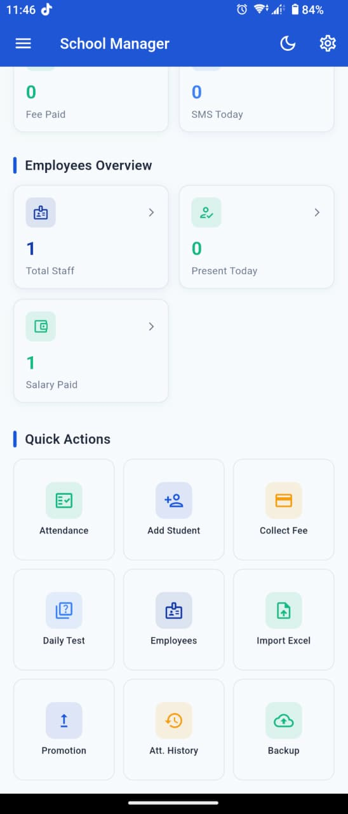
  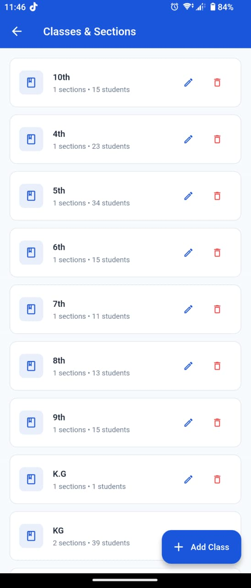
  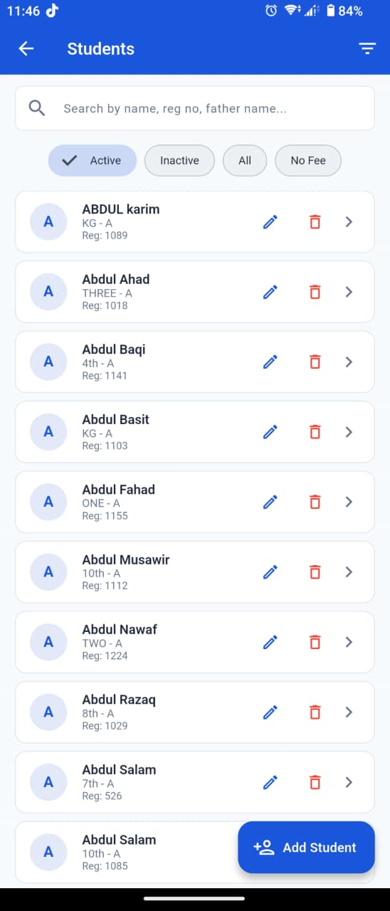
</p>

<p align="center">
  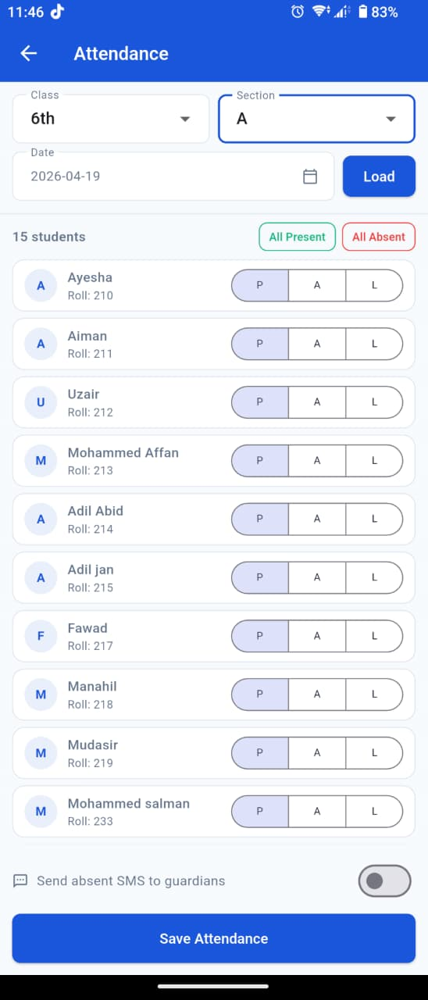
  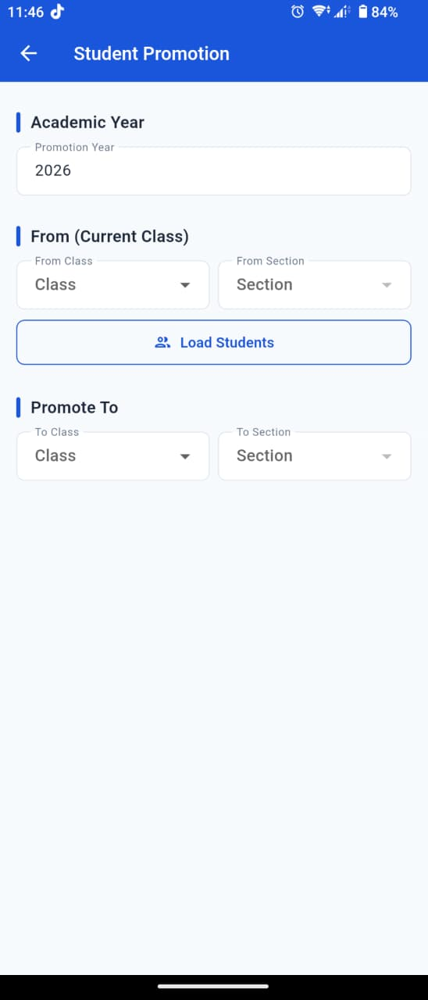
  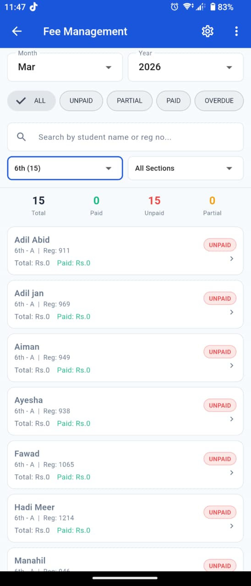
  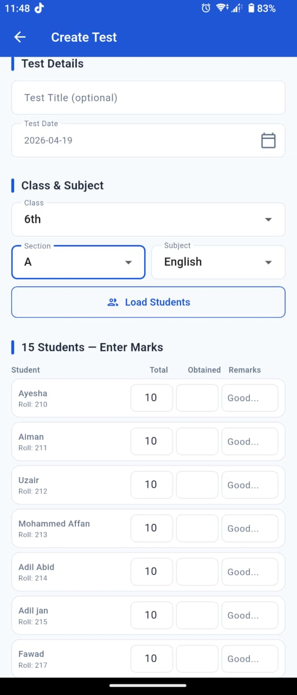
  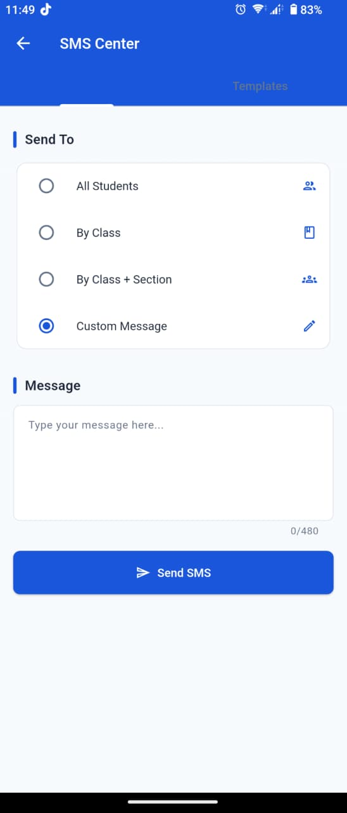
</p>

---
---

Developed by **Engr. Hamza Asad**.

*Made for offline private school management. No internet required. No backend. No cloud.*
